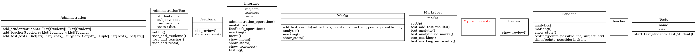
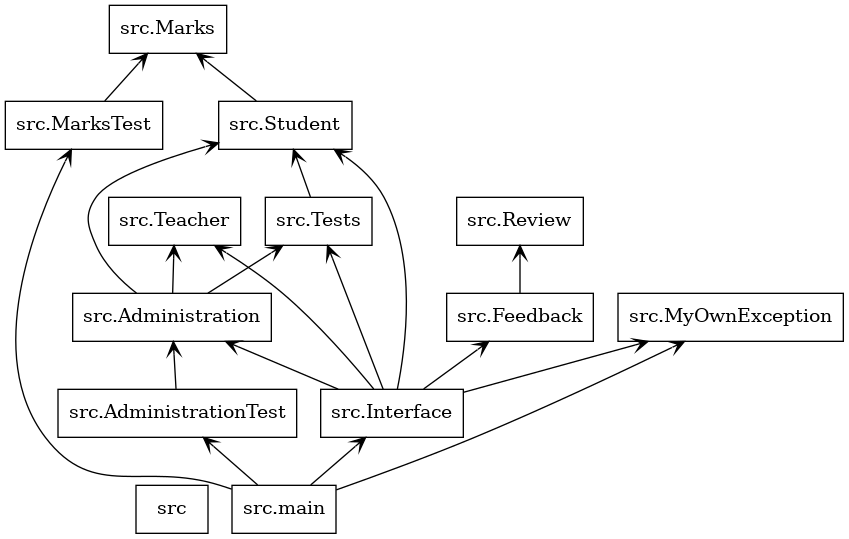

 Модель системы тестирования знаний 
==================================
## *Главные сущности*
- ### *Interface* 
- ### *Marks*
- ### *Student*
- ### *Tests*
- ### *Administration*

##  **Interface** 

### **Реализует основные операции взаимодействия с пользователем. Хранит все переменные, требуемые для работы программы.**

### Методы

- `__validate_input` - метод проверяющий ввод пользователя. Пока введённое значение не будет в пределах lower_boundary, upper_boundary.

- `menu` - метод позволяющий пользователю выбрать пункт меню.

- `administration_operation` - метод для администрирования.

- `testing` - метод для обработки выбора теста.

--------------------------------------

##  **Marks** 

### **Хранит результаты тестов, оценки, аналитику студента**

### Основные поля

- `__test_results ` - хранит массив кортежей формата: (предмет,набранные баллы,максимальное кол-во баллов).

-  `__marks` - является словарём для хранения уже оценнёных значений результатов теста, ключ = предмет, а значение = массив int.

-  `__analytics` - является словарём для хранения уже проанализированных значений результатов оценок, ключ = предмет, а значение = массив со значениями сдал или не сдал.

-   `__undone__marks` - массив хранящий кортежи формата:(предмет,оценка).Используется для отслеживания, какие из оценок не проанализированы.

-----------------------

##  **Student** 

### **Хранит данные студента**

### Основные методы

- `testing` - нужен для проведения тестирования.

-  `think` - метод для решения теста (просто рандомное число от 1 до максимального балла)))))))))).

-----------------------

##  **Tests** 

### **Запускает тесты для студентов**

### Основные методы

- `start_test` - нужен для начала тестирования.

### Основные поля

- `__size` - размер теста.

- `__subject` - предмет теста.

- `__name` - название теста, нужно для того, чтобы различить один тест от другого по одному и тому же предмету.

-----------------------

##  **Administration** 

### **Отвечает за администрирование системы**

### Методы (все статические)

- `add_student` - нужен для добавления студента к массиву students.
- `add_teacher` - нужен для добавления преподавателя к массиву students.
- `add_test` - нужен для добавления студента к массиву students.

# Диаграммы 

