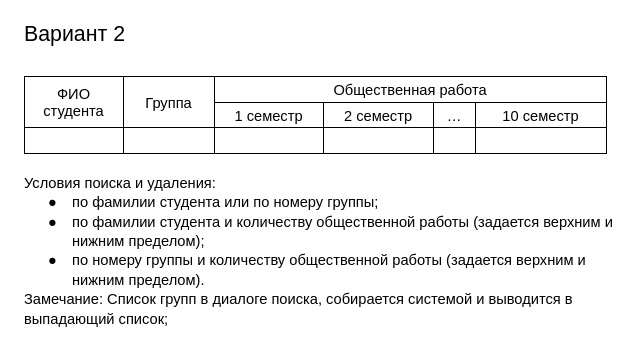
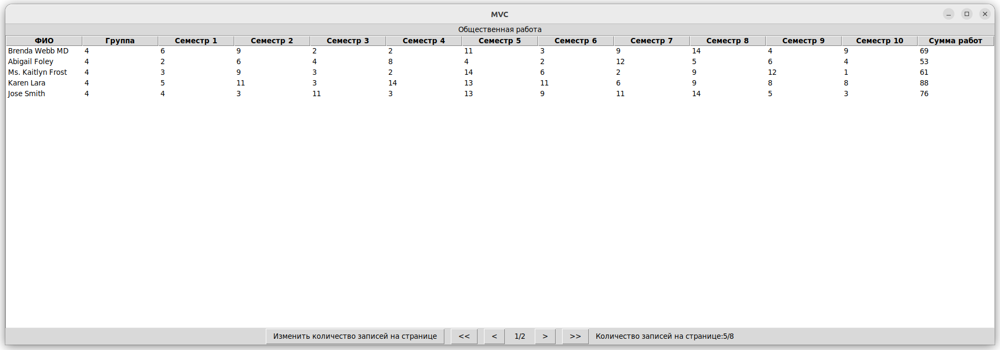
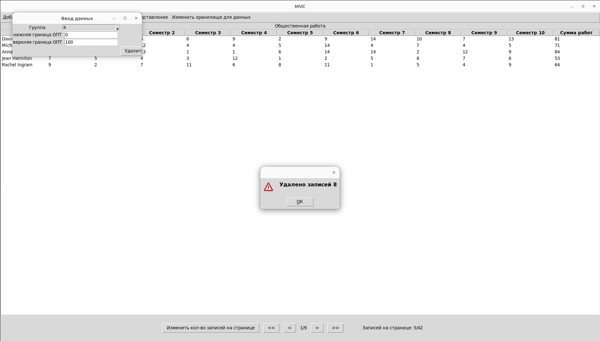
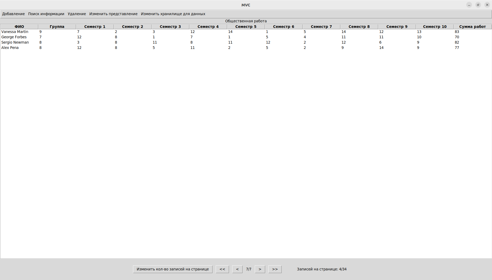
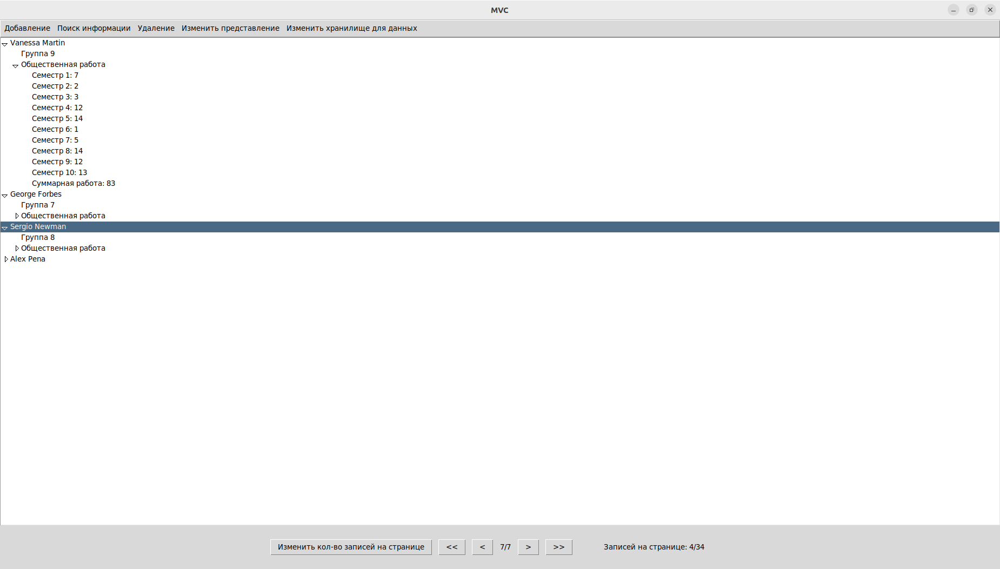
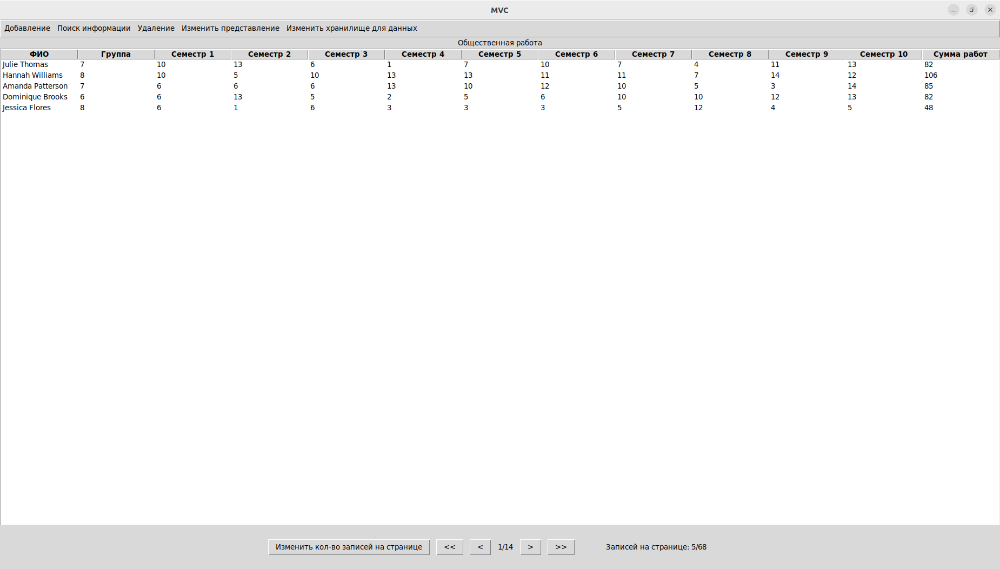
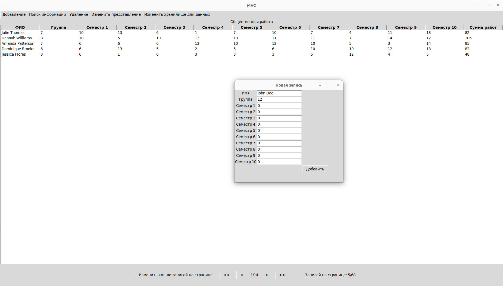
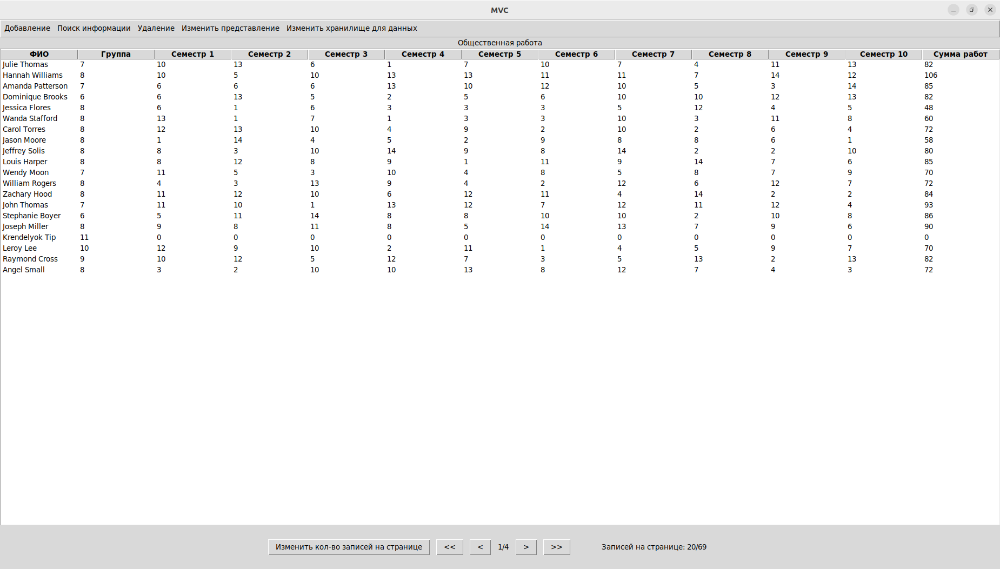

# Лабораторная работа №2 (Вариант 2)

В рамках лабораторной работы №2 было разработано приложение, предназначенное для управления  студентами.

Цель проделанной работы:
- Изучить принципы построения графического пользовательского интерфейса
- Разработать программную систему с графическим пользовательским интерфейсом на языке Python

## Задание

Разработать оконное приложение с одним главным окном и несколькими      дочерними диалогами. Вызов диалогов осуществляется через соответствующие пункты меню. Команды меню должны дублироваться на панели инструментов. 

## Структура данных по варианту

## Про приложение
Данное приложение имеет 3 основных модуля

+ ### model

    
    + В базе данных используется SQLAlchemy для удобного обращения к базе данных с использованием ORM (Object-Relational Mapping).

    + В XML используется библиотека xml. DOM-парсер для записи/удаления из файла. SAX-парсер для чтения информации из файла

+ ### view

    + GUIview - главный модуль для отображения информации, разработанный на основе библиотеки tkinter.

    + Views - вспомогательный модуль, где описаны способы представления информации (табличный и в виде дерева)

+ ### controller

    + StudentController - модуль, связывающий предыдущие два между собой и контролирующий обновление GUI.

## Демонстрация работы системы

### 1 Модель

+ Пользователь загружает файл в программу

+ Находит студентов 4 группы

+ Удаляет тех студентов 4 группы, у кого от 0 до 100 часов ОПТ

+ Перелистывает на последнюю страницу приложения

+ Меняет представление

+ Переключается на базу данных

### 2 Модель

+ Пользователь открывает базу данных

+ Записывает туда новые данные

+ Меняет количество записей на странице

## Заключение

В данном проекте было разработано приложение с графическим интерфейсом, позволяющее управлять моделями с данными. Также пользователь может сам выбирать какой файл открыть для считывания базы данных. Были получены навыки по созданию приложений с графическим интерфейсом, а также навыки по работе с базами данных.