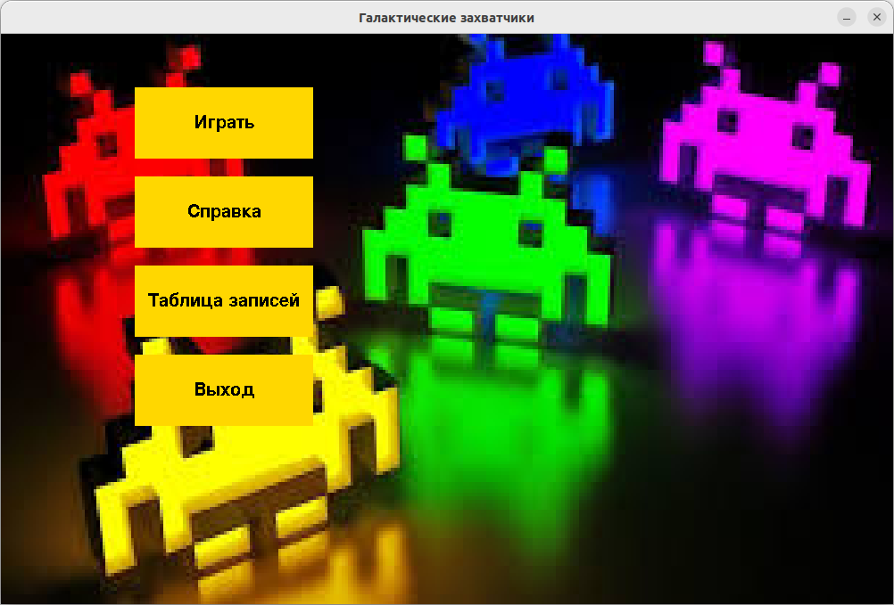
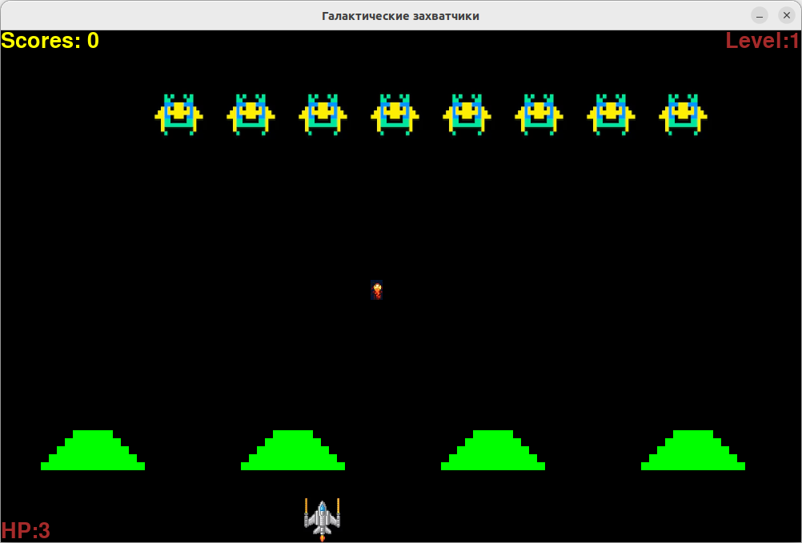
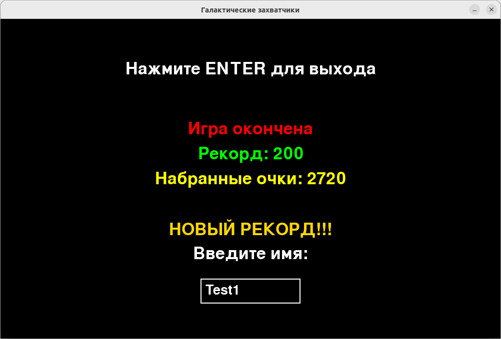
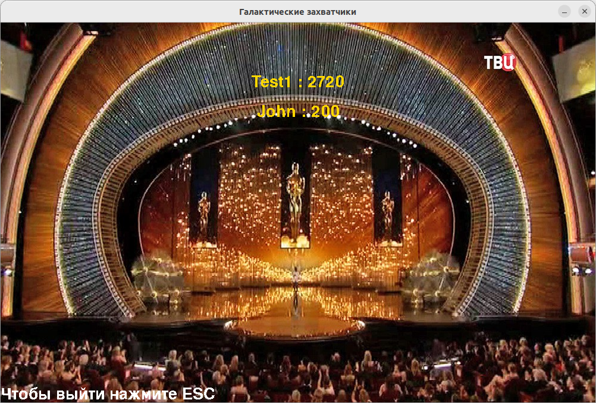

# Галактические захватчики (pygame)

## Задачей данного проекта было обучение работе с pygame. Использование ООП для создания игры. Реализация стандратных игровых механик, а также ознакомление с event-driven архитектурой создания приложений.

## Требования

- ***Реализовать большинство механик оригинальной игры***
- ***Хранить характеристики программы в json-формате***
- ***Добавить 3 вида оружия***
- ***Реализовать выпадение оружия из поверженных противников***

## Структура проекта
Структуру проекта можно разделить на несколько главных модулей.

- ### level
В данном модуле реализована вся игра. Активируется, когда пользователь выбирает кнопку "Играть" в главном меню игры.

#### *Модули*

 - Entities
    В данном модуле хранятся все сущности. Игрок, Враги, Загрузчик врагов из файла по уровням и вспомогательные классы, необходимые для удобства организации врагов. Также там хранится всё для оружия и пуль.
 - Collisions
    В данном модуле реализованы классы для обработки столкновений между объектами. Каждый класс обрабатывает столкновение между различными группами.
 - Obstacles
    Отвечает за создание укрытий на карте
 - GameOver
    Нужен для показа экрана окончания игры, где пользователь, если он поставил новый рекорд, может ввести имя.

- ### menu
Данный модуль нужен для показа игроку главного меню игры.
#### *Модули*

 - PlayerDatabase
    Нужен для работы с БД, с целью хранения таблицы рекордсменов.

 - TableRecords
    Демонстрирует пользователю таблицу рекордов

 - Info
    Экран справки, где пользователь видит врагов, за какого сколько начисляют очков, а также может ознакомиться с управлением и правилами игры.

- ### Game
 Модуль который связывает между собой menu и level.

 - ### audio
Модуль в котором хранится музыка для игры.

 - ### graphics
 Модуль в котором хранятся изображения, используемые в игре.

 ## Демонстрация работы игры 

 

 

 

 

## Заключения:
 Была разработана дополненная pygame-версия игры "Space invaders". В целом, стоит отметить, что в игре очень легко добавлять новых врагов, а также создавать свои волны. Были получены практические навыки разработки игр с использованием pygame. 